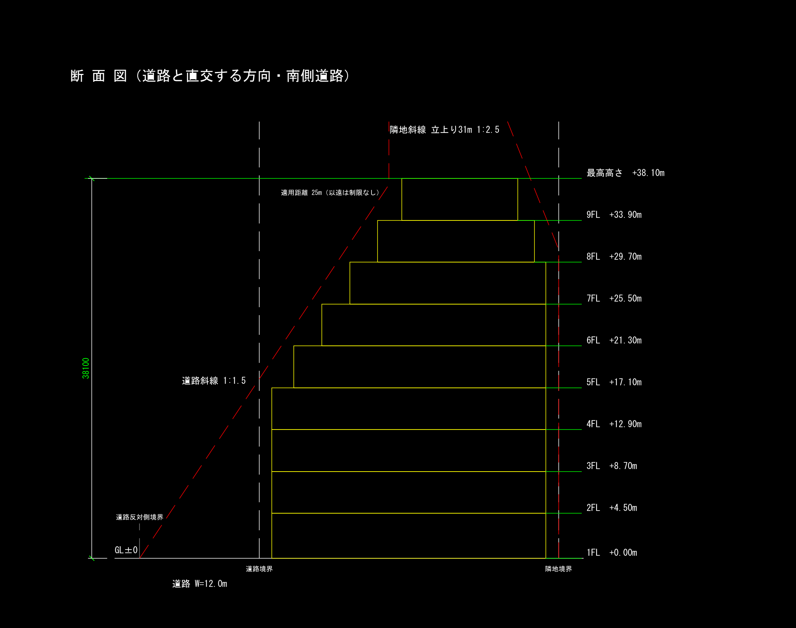

# ボリュームチェック図 自動生成ツール

オフィス・テナントビルの企画段階で、敷地条件と法規条件から建築可能ボリュームを算定し、
**DXF図面1枚**として出力する。CLI と Web アプリの両方から使える。

> **企画検討用の試算です。** 日影規制・北側斜線・高度地区・地区計画は未考慮。
> 天空率は道路斜線について「緩和できる見込みがあるか」の試算のみ。
> **確認申請には使用できません。** 建築士による確認が必要です。



## できること

- 前面道路幅員による容積率の低減（法52条2項）
- 道路斜線（法56条1項1号・別表第三）— 適用距離による頭打ちを含む
- 隣地斜線（法56条1項2号）
- 絶対高さ制限（法55条）
- 建蔽率による全階一律の絞り込み（法53条）と、防火地域・角地による緩和（法53条3項・6項）
- 階別の可能形状・面積表・打ち切り理由の算定
- 配置図＋断面図＋面積表＋表題欄を1枚にまとめた DXF 出力
- どの規定がどれだけボリュームを削っているかの算定
- **任意形状の敷地**（凹形状・複数の前面道路にも対応）
- **建物の振り角**の指定と、条件を振った**複数案の自動生成・比較**
- **天空率による道路斜線の緩和可能性の判定**（法56条7項1号・令135条の5〜9）— 複数案の比較表にも判定列として出る
- 地図から敷地を指定して、断面図・配置図・各階平面図をブラウザでプレビュー（Web版）
- 用途地域・建蔽率・容積率・防火地域などの自動取得（Web版・要APIキー）

適用した規定と根拠条文、および未考慮事項は**すべて図面上に自動で印字される**。

## 使い方

### CLI

```bash
python main.py samples/case_road12.json out/case_road12.dxf
```

入力JSON（単位は m）:

```json
{
  "site":    { "frontage": 20.0, "depth": 30.0, "road_width": 12.0, "road_side": "south" },
  "zoning":  { "use_district": "商業地域", "bcr": 0.8,
               "far_designated": 6.0, "height_limit_absolute": null },
  "program": { "floor_height": 4.2, "gf_height": 4.5, "wall_setback": 0.5,
               "core_ratio": 0.18, "max_floors": 30 }
}
```

`frontage` は道路に接する辺の長さ、`road_side` は前面道路の方位（作図の向きを決める）。

非矩形の敷地は頂点列と辺ごとの種別で与える（`samples/case_polygon.json`）。

```json
{
  "site": {
    "boundary": [[0, 0], [26, 0], [30, 16], [12, 24], [0, 14]],
    "edges": [
      { "kind": "road", "width": 8.0 },
      { "kind": "neighbor" }, { "kind": "neighbor" },
      { "kind": "neighbor" }, { "kind": "neighbor" }
    ],
    "road_side": "south"
  }
}
```

辺ごとに道路幅員を持てるので、2面道路ならそれぞれの幅員で道路斜線が判定される。
`program.building_angle` で前面道路に対する建物の振り角[度]を指定できる。

### Web アプリ

```bash
pip install -r requirements.txt
python -m uvicorn web.app:app --reload --port 8000
```

→ http://localhost:8000

地図で敷地の矩形を描くと間口・奥行が入り、断面図と面積表がその場で更新される。
詳細と Railway へのデプロイ手順は [`web/README.md`](web/README.md) を参照。

## 構成

```
constants.py   法規定数（すべて条文番号のコメント付き。ここ以外に法規の値を書かない）
models.py      入出力のdataclass（入力は m、内部は mm。換算は入口で1回だけ）
solver.py      階別の可能形状を算定
geometry.py    敷地形状と建築可能領域（shapely への依存はここだけ）
section.py     断面の幾何（DXFとSVGプレビューで共有する唯一の定義）
plan.py        平面の幾何と方位による回転（同上）
studies.py     条件を振った複数案の自動生成と比較
skyfactor.py   天空率の算定と、道路斜線を緩和できるかの判定
drawer.py      DXF出力
main.py        CLI
web/           FastAPI + Leaflet の Web アプリ
samples/       サンプル入力
tests/         pytest
```

計算ロジックは `solver.py` に閉じており、`drawer.py` も `web/` も法規の判断をしない。

## 開発

```bash
pip install -r requirements.txt
pip install pytest
pytest
```

外部依存は実行時が `ezdxf` / `shapely` / `numpy` / `fastapi` / `uvicorn` / `httpx` の6つ。

当初は矩形限定として幾何ライブラリを使わず float の四則演算だけで解いていたが、
任意形状の敷地に対応するにあたって `shapely` を入れた。斜線の後退は「境界線からの
距離」なので、辺ごとに帯を差し引いて建築可能領域を作っている。矩形の場合は従来の
単純計算と厳密に一致することをテストで担保している（`tests/test_polygon.py`）。

天空率は `numpy` で方位角を走査して算定する。算定式が定義（令135条の5）どおりで
あることは、式を使わない独立な方法（正射影円上の各点へ実際にレイを飛ばし、shapely の
交差判定だけで遮られるかを決める）と突き合わせて確かめている（`tests/test_skyfactor.py`）。

テストは性質テスト（どんな入力でも成り立つこと）と、手計算で検算した具体ケースの両方を置いている。

## 法規定数について

特定行政庁の指定や都市計画で値が変わる項目は**法の原則値**を既定とし、
どの値を採用したかを算定結果と図面に必ず記録する。自治体が別の指定をしている場合は
その値で上書きして再計算すること。詳細は `constants.py` のコメントを参照。
